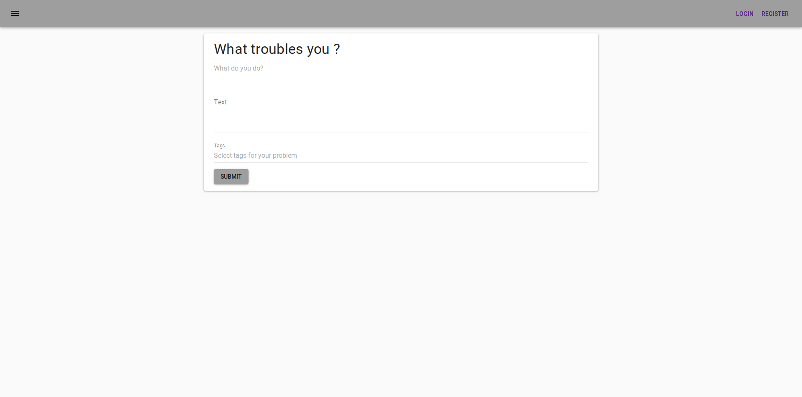
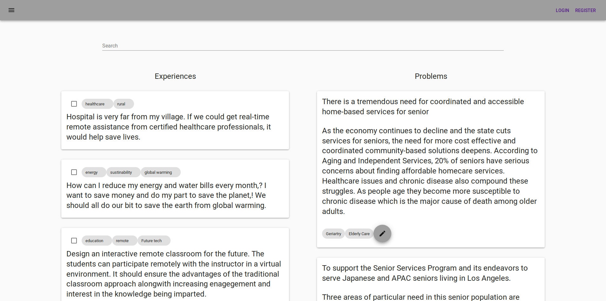
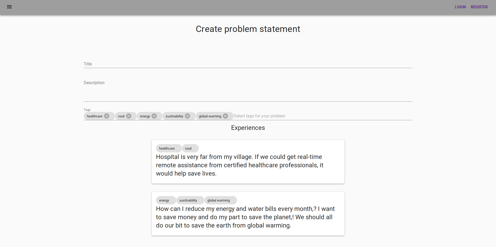
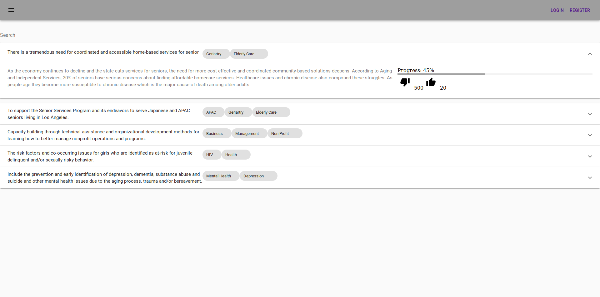

# hack-nyu
This repository contains the code for <b>problem-overflow</b> platform developed [@hack-nyu](https://hacknyu.org/)

## [](https://www.youtube.com/watch?v=b34PgqB8Juo)

## Screens







## Dependencies
- [Yarn](https://yarnpkg.com/lang/en/docs/install)
- [Docker](https://docs.docker.com/)
- Docker-compose on your system
- Install npm dependencies with the following command
```
yarn install
```

## Intructions to Run
- Download/clone the repo and navigate to the root folder:-

```
cd hack-nyu
```
- Start and load the front-end app from docker container. 
```
yarn run build
docker-compose up --build
```
Access the app on http://localhost:4000

- Run UI in webpack-dev-server & backend in docker container
```
docker-compose up --build
yarn run serve
```
Access the app on http://localhost:8080


